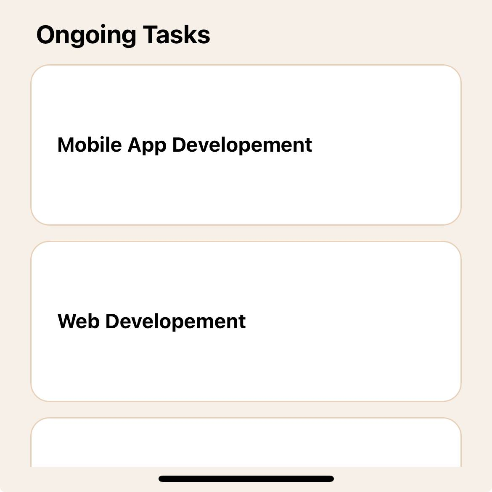

# rn-assignment3-11310750

- This is an application that manages tasks

# header

- The header is created as a custom component with the name "header.js", which contains the texts "Hello , Devs" and "14 tasks today" which are all done with the <Text></Text> core component imported from "react-native" and an image to render the user_icon us the <Image></Image> core component

This is a screenshot of the header component

# search

- The search is also created as a custom component with the name "seaarch.js".
- The search bar was created with the core component <TextInput> which has a placeholder of "Search".
- the button was created by using the core component <Pressable></Pressable> for it to be pressed and <Image /> for the background image

- This is a screenshot of the search component
  

# category

- The category component is also created as a custom component with the name "category.js".
- The text "Categories" was created with the core component <Text></Text>.
- The individual categories is rendered with an array  "const cat_array = []" and the ".map" function "    {cat_array.map((cat_array) => (
          <View style={styles.container_1}>
            <Text style={styles.h1}>{cat_array.topic}</Text>
            <Text style={styles.h2}>{cat_array.task_num}</Text>
            <Image style={styles.img} source={cat_array.picture_dir}/>
          </View>
        ))}" 
        
        which was later sandwiched inside a <ScrollView></ScrollView> core component in a seperate component called "card.js"

- "card.js" was then imported into "category.js"

- This is a screenshot of the category component

# tasks

- The task component is also created as a custom component with the name "task.js".
- The text "Ongoing Tasks" was created with the core component <Text></Text>.
- The individual tasks is rendered with an array  "const task_array = []" and the ".map" function "    {task_array.map((task_array) => (
        <View style={styles.container}>
          <Text style={styles.h1}>{task_array}</Text>
        </View>
      ))}" 
        
        which was later sandwiched inside a <ScrollView></ScrollView> core component in a seperate component called "task_card.js"

- "task_card.js" was then imported into "task.js"

- This is a screenshot of the task component

# Screenshots of the app

